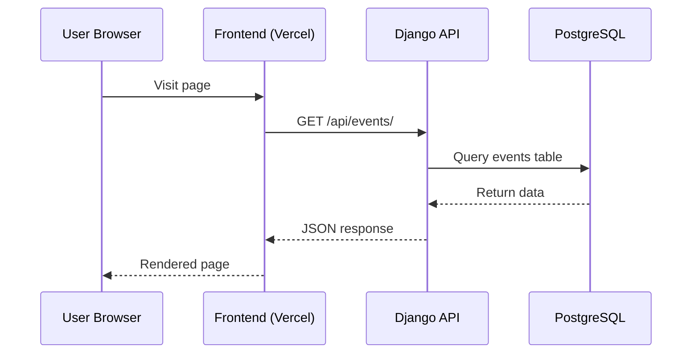
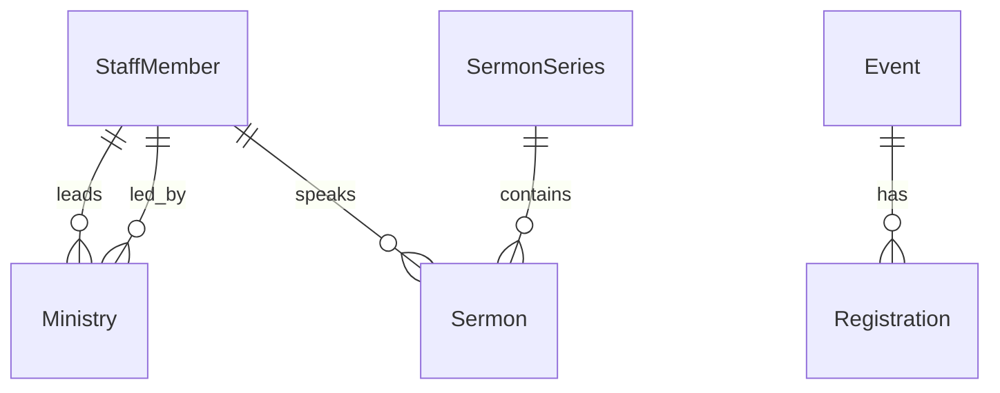
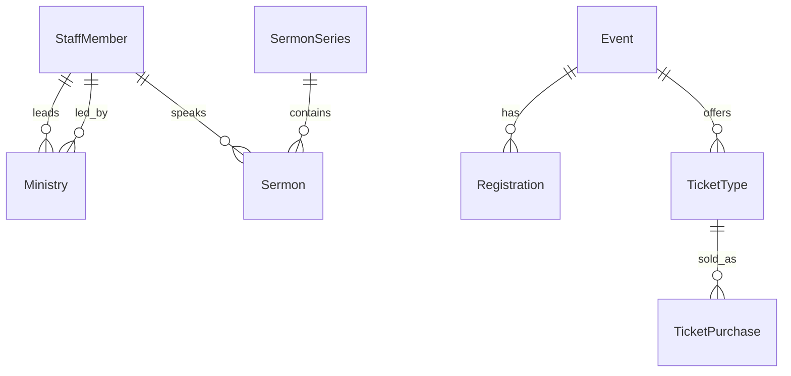

# Unity Community Church - Technical Architecture

> **Version:** 1.0.0  
> **Created:** December 22, 2025  
> **Related:** [MVP Documentation](./MVP_DOCUMENTATION.md)

---

## Table of Contents

1. [System Architecture](#system-architecture)
2. [Clean Code Principles](#clean-code-principles)
3. [Django Backend Architecture](#django-backend-architecture)
4. [React Frontend Architecture](#react-frontend-architecture)
5. [API Design](#api-design)
6. [Database Models](#database-models)
7. [Security Considerations](#security-considerations)

---

## System Architecture

### High-Level Overview

```
┌──────────────────────────────────────────────────────────────────────────┐
│                              PRODUCTION                                   │
├──────────────────────────────────────────────────────────────────────────┤
│                                                                          │
│   ┌─────────────────────────┐        ┌─────────────────────────────┐     │
│   │     Frontend (React)    │        │     Backend (Django)        │     │
│   │     Vite + TypeScript   │        │     REST API + Admin        │     │
│   │     TailwindCSS         │        │                             │     │
│   │                         │        │  ┌─────────────────────┐    │     │
│   │   Deployed on Vercel    │◄──────►│  │   Django REST API   │    │     │
│   │                         │        │  └─────────────────────┘    │     │
│   └─────────────────────────┘        │  ┌─────────────────────┐    │     │
│                                      │  │   Django Admin      │    │     │
│                                      │  │   (Staff Access)    │    │     │
│                                      │  └─────────────────────┘    │     │
│                                      │                             │     │
│                                      │   Deployed on Railway/      │     │
│                                      │   Render/Vercel             │     │
│                                      └──────────────┬──────────────┘     │
│                                                     │                    │
│                                              ┌──────▼──────┐             │
│                                              │  PostgreSQL │             │
│                                              │  (Managed)  │             │
│                                              └─────────────┘             │
│                                                                          │
└──────────────────────────────────────────────────────────────────────────┘
```

### Request Flow



---

## Clean Code Principles

### SOLID Principles

#### Single Responsibility Principle (SRP)

Each module/class handles ONE concern.

**Backend (Django):**

```python
# ✅ Good: Separate Django apps for distinct domains
# apps/events/         → Event management
# apps/media/          → Sermon and media management
# apps/ministries/     → Ministry listings
# apps/giving/         → Donation processing

# ✅ Good: Service layer for business logic
# apps/events/services.py
class EventService:
    """Handles event-related business logic only."""

    def get_upcoming_events(self, limit: int = 10) -> QuerySet[Event]:
        return Event.objects.filter(
            date__gte=timezone.now(),
            is_published=True
        ).order_by('date')[:limit]

    def register_attendee(self, event: Event, attendee_data: dict) -> Registration:
        # Registration logic only
        pass
```

**Frontend (React):**

```typescript
// ✅ Good: Component handles only UI rendering
// components/EventCard.tsx     → Displays event info
// hooks/useEvents.ts           → Fetches and manages event state
// services/eventService.ts     → API calls only
```

---

#### Open/Closed Principle (OCP)

Extend behavior without modifying existing code.

```python
from abc import ABC, abstractmethod

class ContentBlock(ABC):
    """Base content block - extend for new types."""

    @abstractmethod
    def render(self) -> dict:
        pass

class TextBlock(ContentBlock):
    def __init__(self, content: str):
        self.content = content

    def render(self) -> dict:
        return {"type": "text", "content": self.content}

class VideoBlock(ContentBlock):
    def __init__(self, video_url: str, title: str):
        self.video_url = video_url
        self.title = title

    def render(self) -> dict:
        return {"type": "video", "url": self.video_url, "title": self.title}

# Add new block types without modifying existing code
class EventBlock(ContentBlock):
    def __init__(self, event_id: int):
        self.event_id = event_id

    def render(self) -> dict:
        event = Event.objects.get(pk=self.event_id)
        return {"type": "event", "data": EventSerializer(event).data}
```

---

#### Liskov Substitution Principle (LSP)

Subtypes must be substitutable for base types.

```python
from abc import ABC, abstractmethod
from decimal import Decimal

class PaymentProcessor(ABC):
    """All payment processors must fulfill this contract."""

    @abstractmethod
    def process_payment(self, amount: Decimal, metadata: dict) -> PaymentResult:
        pass

    @abstractmethod
    def refund(self, transaction_id: str) -> RefundResult:
        pass

class StripeProcessor(PaymentProcessor):
    def process_payment(self, amount: Decimal, metadata: dict) -> PaymentResult:
        # Stripe-specific implementation
        pass

    def refund(self, transaction_id: str) -> RefundResult:
        pass

class TithelyProcessor(PaymentProcessor):
    def process_payment(self, amount: Decimal, metadata: dict) -> PaymentResult:
        # Tithe.ly-specific implementation
        pass

    def refund(self, transaction_id: str) -> RefundResult:
        pass

# Both can be used interchangeably
def handle_donation(processor: PaymentProcessor, amount: Decimal):
    return processor.process_payment(amount, {"type": "donation"})
```

---

#### Interface Segregation Principle (ISP)

Clients shouldn't depend on interfaces they don't use.

```python
from typing import Protocol

# ❌ Bad: One large interface
class ChurchContentManager(ABC):
    def get_sermons(self): pass
    def get_events(self): pass
    def process_payment(self): pass
    def send_email(self): pass

# ✅ Good: Segregated interfaces (protocols in Python)
class SermonProvider(Protocol):
    def get_sermons(self) -> list: ...
    def get_sermon_by_id(self, sermon_id: int) -> dict: ...

class EventProvider(Protocol):
    def get_events(self) -> list: ...
    def create_event(self, data: dict) -> dict: ...

class PaymentHandler(Protocol):
    def process_payment(self, amount: Decimal) -> dict: ...
```

---

#### Dependency Inversion Principle (DIP)

Depend on abstractions, not concretions.

```python
from typing import Protocol

# Define abstraction
class EventRepository(Protocol):
    def find_all(self) -> list[Event]: ...
    def find_by_id(self, event_id: int) -> Event | None: ...
    def save(self, event: Event) -> Event: ...

# Concrete implementation
class DjangoEventRepository:
    def find_all(self) -> list[Event]:
        return list(Event.objects.all())

    def find_by_id(self, event_id: int) -> Event | None:
        return Event.objects.filter(pk=event_id).first()

    def save(self, event: Event) -> Event:
        event.save()
        return event

# High-level module depends on abstraction
class EventService:
    def __init__(self, repository: EventRepository):
        self.repository = repository

    def get_upcoming_events(self) -> list[Event]:
        events = self.repository.find_all()
        return [e for e in events if e.date > timezone.now()]
```

---

### DRY Principle

Don't Repeat Yourself - centralize common logic.

**Backend:**

```python
# apps/core/models.py - Reusable base models
class TimeStampedModel(models.Model):
    created_at = models.DateTimeField(auto_now_add=True)
    updated_at = models.DateTimeField(auto_now=True)

    class Meta:
        abstract = True

class PublishableModel(TimeStampedModel):
    is_published = models.BooleanField(default=False)
    published_at = models.DateTimeField(null=True, blank=True)

    class Meta:
        abstract = True
```

**Frontend:**

```typescript
// Reusable API client - services/api.ts
const API_BASE = import.meta.env.VITE_API_URL;

export const apiClient = {
  async get<T>(endpoint: string): Promise<T> {
    const response = await fetch(`${API_BASE}/api/${endpoint}`);
    if (!response.ok) throw new ApiError(response);
    return response.json();
  },
  async post<T>(endpoint: string, data: unknown): Promise<T> {
    const response = await fetch(`${API_BASE}/api/${endpoint}`, {
      method: 'POST',
      headers: { 'Content-Type': 'application/json' },
      body: JSON.stringify(data),
    });
    if (!response.ok) throw new ApiError(response);
    return response.json();
  },
};

// Reusable form validation - utils/validation.ts
export const validators = {
  required: (value: string) => (value.trim() ? null : 'Required'),
  email: (value: string) =>
    /^[^\s@]+@[^\s@]+\.[^\s@]+$/.test(value) ? null : 'Invalid email',
  phone: (value: string) =>
    /^\d{10}$/.test(value.replace(/\D/g, '')) ? null : 'Invalid phone',
};
```

---

### Recommended Patterns Summary

| Pattern                | Use Case                   | Frontend        | Backend                  |
| ---------------------- | -------------------------- | --------------- | ------------------------ |
| **Custom Hooks**       | Shared state logic         | `src/hooks/`    | N/A                      |
| **Context API**        | Global state (auth, theme) | `src/contexts/` | N/A                      |
| **Service Layer**      | Business logic             | `src/services/` | `apps/*/services.py`     |
| **Repository Pattern** | Data access                | N/A             | `apps/*/repositories.py` |
| **Serializers**        | Data transformation        | N/A             | `apps/*/serializers.py`  |
| **ViewSets**           | API endpoints              | N/A             | `apps/*/views.py`        |

---

## Django Backend Architecture

### App Structure

Each Django app follows a consistent structure:

```
apps/events/
├── __init__.py
├── admin.py           # Admin configuration
├── models.py          # Database models
├── serializers.py     # DRF serializers
├── services.py        # Business logic (SRP)
├── views.py           # API viewsets
├── urls.py            # URL routing
└── tests/
    ├── test_models.py
    ├── test_views.py
    └── test_services.py
```

### Admin Customization

```python
# apps/events/admin.py

from django.contrib import admin
from django.utils.html import format_html
from .models import Event, Registration

@admin.register(Event)
class EventAdmin(admin.ModelAdmin):
    list_display = ['title', 'date', 'location', 'is_published', 'registration_count']
    list_filter = ['is_published', 'date', 'location']
    search_fields = ['title', 'description']
    list_editable = ['is_published']
    date_hierarchy = 'date'
    ordering = ['-date']

    fieldsets = (
        ('Event Details', {
            'fields': ('title', 'description', 'image')
        }),
        ('Schedule', {
            'fields': ('date', 'start_time', 'end_time', 'location')
        }),
        ('Settings', {
            'fields': ('is_published', 'requires_registration', 'max_attendees'),
            'classes': ('collapse',),
        }),
    )

    def registration_count(self, obj):
        count = obj.registrations.count()
        return format_html(
            '<span style="color: {};">{}</span>',
            'green' if count > 0 else 'gray',
            count
        )
    registration_count.short_description = 'Registrations'
```

### User Roles & Permissions

```python
# apps/core/permissions.py

ROLE_PERMISSIONS = {
    "Super Admin": {
        "description": "Full access to all features",
        "permissions": ["*"]
    },
    "Content Editor": {
        "description": "Edit pages, events, media",
        "permissions": [
            "content.*",
            "events.view_event",
            "events.change_event",
            "media.*",
        ]
    },
    "Event Manager": {
        "description": "Manage events and registrations only",
        "permissions": ["events.*"]
    },
    "Viewer": {
        "description": "Read-only dashboard access",
        "permissions": ["*.view_*"]
    }
}
```

---

## React Frontend Architecture

### Component Organization

```
src/
├── theme/
│   └── theme.ts              # MUI theme configuration
├── components/
│   ├── layout/               # Layout components
│   │   ├── Header.tsx        # Uses MUI AppBar, Toolbar
│   │   ├── Footer.tsx
│   │   ├── Navigation.tsx    # Uses MUI Drawer, List
│   │   └── MobileMenu.tsx    # Uses MUI SwipeableDrawer
│   └── features/             # Feature-specific components (SRP)
│       ├── events/
│       │   ├── EventCard.tsx
│       │   ├── EventList.tsx # Uses MUI Grid
│       │   └── EventRegistrationForm.tsx  # Uses MUI TextField, Dialog
│       ├── media/
│       │   ├── SermonCard.tsx
│       │   └── VideoPlayer.tsx
│       └── giving/
│           └── DonationForm.tsx  # Uses MUI Stepper, TextField
```

### UI Library: Material UI (MUI)

Material UI is the recommended component library for this project, providing:

- **Production-ready components**: Buttons, cards, modals, forms, navigation
- **Theming system**: Consistent branding with custom theme
- **Accessibility**: WCAG 2.1 compliant out-of-the-box
- **Responsive**: Built-in breakpoint system
- **TypeScript support**: Full type definitions

#### Theme Configuration

```typescript
// src/theme/theme.ts
import { createTheme } from '@mui/material/styles';

export const churchTheme = createTheme({
  palette: {
    primary: {
      main: '#1976d2', // Church brand blue
      light: '#42a5f5',
      dark: '#1565c0',
    },
    secondary: {
      main: '#9c27b0', // Accent purple
      light: '#ba68c8',
      dark: '#7b1fa2',
    },
    background: {
      default: '#fafafa',
      paper: '#ffffff',
    },
  },
  typography: {
    fontFamily: '"Inter", "Roboto", "Helvetica", "Arial", sans-serif',
    h1: { fontWeight: 700 },
    h2: { fontWeight: 600 },
    button: { textTransform: 'none' }, // No uppercase buttons
  },
  shape: {
    borderRadius: 8,
  },
  components: {
    MuiButton: {
      styleOverrides: {
        root: {
          borderRadius: 8,
          padding: '10px 24px',
        },
      },
    },
    MuiCard: {
      styleOverrides: {
        root: {
          boxShadow: '0 2px 8px rgba(0,0,0,0.08)',
        },
      },
    },
  },
});
```

#### Provider Setup

```typescript
// src/App.tsx
import { ThemeProvider, CssBaseline } from '@mui/material';
import { churchTheme } from './theme/theme';

function App() {
  return (
    <ThemeProvider theme={churchTheme}>
      <CssBaseline /> {/* Normalize CSS */}
      <RouterProvider router={router} />
    </ThemeProvider>
  );
}
```

#### Component Usage Examples

```typescript
// components/features/events/EventCard.tsx
import {
  Card,
  CardContent,
  CardMedia,
  CardActions,
  Typography,
  Button,
  Chip,
} from '@mui/material';
import { CalendarToday, LocationOn } from '@mui/icons-material';

export function EventCard({ event }: { event: Event }) {
  return (
    <Card
      sx={{
        maxWidth: 345,
        height: '100%',
        display: 'flex',
        flexDirection: 'column',
      }}
    >
      <CardMedia
        component="img"
        height="140"
        image={event.image}
        alt={event.title}
      />
      <CardContent sx={{ flexGrow: 1 }}>
        <Typography gutterBottom variant="h5" component="h2">
          {event.title}
        </Typography>
        <Chip
          icon={<CalendarToday />}
          label={formatDate(event.date)}
          size="small"
          sx={{ mr: 1, mb: 1 }}
        />
        <Chip
          icon={<LocationOn />}
          label={event.location}
          size="small"
          variant="outlined"
        />
        <Typography variant="body2" color="text.secondary" sx={{ mt: 2 }}>
          {event.description}
        </Typography>
      </CardContent>
      <CardActions>
        <Button size="small" color="primary">
          Learn More
        </Button>
        {event.requires_registration && (
          <Button size="small" variant="contained" color="primary">
            Register
          </Button>
        )}
      </CardActions>
    </Card>
  );
}
```

### State Management

```typescript
// contexts/AuthContext.tsx
import { createContext, useContext, useState, ReactNode } from 'react';

export const AuthContext = createContext<AuthState | null>(null);

export function AuthProvider({ children }: { children: ReactNode }) {
  const [user, setUser] = useState<User | null>(null);

  // Auth logic...

  return (
    <AuthContext.Provider value={{ user, login, logout }}>
      {children}
    </AuthContext.Provider>
  );
}

// hooks/useAuth.ts
export function useAuth() {
  const context = useContext(AuthContext);
  if (!context) throw new Error('useAuth must be used within AuthProvider');
  return context;
}
```

### MUI + TailwindCSS Integration

MUI handles component styling while TailwindCSS provides utility classes for custom layouts:

```typescript
// Using both together
import { Button, Card } from '@mui/material';

function HeroSection() {
  return (
    // Tailwind for layout, MUI for components
    <section className="min-h-screen flex items-center justify-center bg-gradient-to-b from-blue-50 to-white">
      <div className="container mx-auto px-4 text-center">
        <h1 className="text-5xl font-bold mb-6">
          Welcome to Unity Community Church
        </h1>
        <Button variant="contained" size="large" color="primary">
          Join Us Sunday
        </Button>
      </div>
    </section>
  );
}
```

---

## API Design

### URL Structure

```python
# config/urls.py
urlpatterns = [
    path('admin/', admin.site.urls),
    path('api/events/', include('apps.events.urls')),
    path('api/ministries/', include('apps.ministries.urls')),
    path('api/media/', include('apps.media_library.urls')),
    path('api/staff/', include('apps.staff.urls')),
    path('api/content/', include('apps.content.urls')),
    path('api/contact/', include('apps.contact.urls')),
]
```

### ViewSet Example

```python
# apps/events/views.py

from rest_framework import viewsets, permissions
from rest_framework.decorators import action
from rest_framework.response import Response
from django.utils import timezone
from .models import Event, Registration
from .serializers import EventSerializer, RegistrationSerializer

class EventViewSet(viewsets.ReadOnlyModelViewSet):
    """Public API for events - read only."""
    serializer_class = EventSerializer
    permission_classes = [permissions.AllowAny]
    lookup_field = 'slug'

    def get_queryset(self):
        return Event.objects.filter(is_published=True)

    @action(detail=False, methods=['get'])
    def upcoming(self, request):
        """GET /api/events/upcoming/"""
        events = self.get_queryset().filter(
            date__gte=timezone.now().date()
        ).order_by('date')[:10]
        serializer = self.get_serializer(events, many=True)
        return Response(serializer.data)

    @action(detail=True, methods=['post'])
    def register(self, request, slug=None):
        """POST /api/events/{slug}/register/"""
        event = self.get_object()
        serializer = RegistrationSerializer(data=request.data)
        if serializer.is_valid():
            serializer.save(event=event)
            return Response(serializer.data, status=201)
        return Response(serializer.errors, status=400)
```

### Response Format

```json
// GET /api/events/upcoming/
{
  "results": [
    {
      "id": 1,
      "title": "Sunday Service",
      "slug": "sunday-service",
      "description": "Join us for worship...",
      "image": "/media/events/sunday-service.jpg",
      "date": "2024-12-29",
      "start_time": "10:00:00",
      "end_time": "12:00:00",
      "location": "Main Sanctuary",
      "requires_registration": false,
      "spots_remaining": null
    }
  ]
}
```

---

## Database Models

### Core Abstract Models

```python
# apps/core/models.py

from django.db import models

class TimeStampedModel(models.Model):
    """Abstract base model with created/updated timestamps."""
    created_at = models.DateTimeField(auto_now_add=True)
    updated_at = models.DateTimeField(auto_now=True)

    class Meta:
        abstract = True

class PublishableModel(TimeStampedModel):
    """Abstract model for content that can be published/unpublished."""
    is_published = models.BooleanField(default=False)
    published_at = models.DateTimeField(null=True, blank=True)

    class Meta:
        abstract = True
```

### Domain Models

```python
# apps/events/models.py

class Event(PublishableModel):
    title = models.CharField(max_length=200)
    slug = models.SlugField(unique=True)
    description = models.TextField()
    image = models.ImageField(upload_to='events/', blank=True)
    date = models.DateField()
    start_time = models.TimeField()
    end_time = models.TimeField(null=True, blank=True)
    location = models.CharField(max_length=200)
    requires_registration = models.BooleanField(default=False)
    max_attendees = models.PositiveIntegerField(null=True, blank=True)

    class Meta:
        ordering = ['-date', '-start_time']

    @property
    def spots_remaining(self):
        if not self.max_attendees:
            return None
        return self.max_attendees - self.registrations.count()
```

```python
# apps/ministries/models.py

class Ministry(PublishableModel):
    name = models.CharField(max_length=200)
    slug = models.SlugField(unique=True)
    description = models.TextField()
    image = models.ImageField(upload_to='ministries/')
    leader = models.ForeignKey('staff.StaffMember', on_delete=models.SET_NULL, null=True)
    meeting_time = models.CharField(max_length=200, blank=True)
    meeting_location = models.CharField(max_length=200, blank=True)
    order = models.PositiveIntegerField(default=0)

    class Meta:
        ordering = ['order', 'name']
        verbose_name_plural = 'Ministries'
```

```python
# apps/media_library/models.py

class Sermon(PublishableModel):
    title = models.CharField(max_length=200)
    slug = models.SlugField(unique=True)
    description = models.TextField(blank=True)
    series = models.ForeignKey('SermonSeries', on_delete=models.SET_NULL, null=True)
    speaker = models.ForeignKey('staff.StaffMember', on_delete=models.SET_NULL, null=True)
    date = models.DateField()
    scripture_reference = models.CharField(max_length=200, blank=True)
    video_url = models.URLField(blank=True)
    audio_file = models.FileField(upload_to='sermons/audio/', blank=True)
    thumbnail = models.ImageField(upload_to='sermons/thumbnails/', blank=True)
    duration_minutes = models.PositiveIntegerField(null=True, blank=True)

    class Meta:
        ordering = ['-date']
```

### Entity Relationship Diagram



---

## Event Ticketing System

### Data Schema

```python
# apps/events/models.py

class TicketType(models.Model):
    """Ticket pricing tier for an event."""
    event = models.ForeignKey(Event, on_delete=models.CASCADE, related_name='ticket_types')
    name = models.CharField(max_length=100)  # e.g., "General Admission", "VIP"
    price = models.DecimalField(max_digits=8, decimal_places=2)
    quantity_available = models.PositiveIntegerField(default=100)

    class Meta:
        ordering = ['price']

    def __str__(self):
        return f"{self.event.title} - {self.name} (${self.price})"

    def spots_remaining(self):
        sold = self.purchases.filter(payment_status='confirmed').aggregate(
            total=models.Sum('quantity')
        )['total'] or 0
        return self.quantity_available - sold


class TicketPurchase(TimeStampedModel):
    """A ticket purchase/registration record."""

    class PaymentStatus(models.TextChoices):
        PENDING = 'pending', 'Pending Payment'
        SUBMITTED = 'submitted', 'Payment Submitted'
        CONFIRMED = 'confirmed', 'Payment Confirmed'
        CANCELLED = 'cancelled', 'Cancelled'

    # Buyer Information
    first_name = models.CharField(max_length=100)
    last_name = models.CharField(max_length=100)
    email = models.EmailField()
    phone = models.CharField(max_length=20)

    # Ticket Details
    ticket_type = models.ForeignKey(TicketType, on_delete=models.PROTECT, related_name='purchases')
    quantity = models.PositiveIntegerField(default=1)

    # Payment Tracking
    reference_code = models.CharField(max_length=20, unique=True, editable=False)
    payment_status = models.CharField(
        max_length=20,
        choices=PaymentStatus.choices,
        default=PaymentStatus.PENDING
    )
    payment_note = models.TextField(blank=True, help_text="Admin notes about payment")

    class Meta:
        ordering = ['-created_at']

    def __str__(self):
        return f"{self.reference_code} - {self.first_name} {self.last_name}"

    def save(self, *args, **kwargs):
        if not self.reference_code:
            self.reference_code = self._generate_reference()
        super().save(*args, **kwargs)

    def _generate_reference(self):
        import random, string
        return 'UCC-' + ''.join(random.choices(string.ascii_uppercase + string.digits, k=8))

    @property
    def total_amount(self):
        return self.ticket_type.price * self.quantity
```

### Email Notification Service

```python
# apps/events/services.py

from django.core.mail import send_mail
from django.template.loader import render_to_string
from django.conf import settings

class TicketEmailService:
    """Handles ticket confirmation emails."""

    @staticmethod
    def send_buyer_confirmation(purchase: TicketPurchase):
        """Send confirmation email to the ticket buyer."""
        context = {
            'purchase': purchase,
            'event': purchase.ticket_type.event,
            'cash_app_handle': settings.CASH_APP_HANDLE,
        }
        html_message = render_to_string('emails/ticket_confirmation.html', context)

        send_mail(
            subject=f'Ticket Confirmation - {purchase.ticket_type.event.title}',
            message=f'Reference: {purchase.reference_code}',
            from_email=settings.DEFAULT_FROM_EMAIL,
            recipient_list=[purchase.email],
            html_message=html_message,
        )

    @staticmethod
    def send_admin_notification(purchase: TicketPurchase):
        """Notify admin of new ticket purchase."""
        context = {
            'purchase': purchase,
            'event': purchase.ticket_type.event,
        }
        html_message = render_to_string('emails/admin_ticket_notification.html', context)

        send_mail(
            subject=f'[UCC] New Ticket: {purchase.first_name} {purchase.last_name} - {purchase.reference_code}',
            message=f'New ticket purchase: {purchase.reference_code}',
            from_email=settings.DEFAULT_FROM_EMAIL,
            recipient_list=[settings.ADMIN_EMAIL],
            html_message=html_message,
        )
```

### Admin Panel Configuration

```python
# apps/events/admin.py

@admin.register(TicketType)
class TicketTypeAdmin(admin.ModelAdmin):
    list_display = ['event', 'name', 'price', 'quantity_available', 'spots_remaining']
    list_filter = ['event']


@admin.register(TicketPurchase)
class TicketPurchaseAdmin(admin.ModelAdmin):
    list_display = [
        'reference_code', 'full_name', 'event_name',
        'quantity', 'total_display', 'payment_status', 'created_at'
    ]
    list_filter = ['payment_status', 'ticket_type__event', 'created_at']
    search_fields = ['first_name', 'last_name', 'email', 'phone', 'reference_code']
    list_editable = ['payment_status']
    readonly_fields = ['reference_code', 'created_at', 'updated_at', 'total_display']
    date_hierarchy = 'created_at'

    fieldsets = (
        ('Buyer Information', {
            'fields': ('first_name', 'last_name', 'email', 'phone')
        }),
        ('Ticket Details', {
            'fields': ('ticket_type', 'quantity', 'total_display')
        }),
        ('Payment', {
            'fields': ('reference_code', 'payment_status', 'payment_note')
        }),
        ('Timestamps', {
            'fields': ('created_at', 'updated_at'),
            'classes': ('collapse',)
        }),
    )

    def full_name(self, obj):
        return f'{obj.first_name} {obj.last_name}'
    full_name.short_description = 'Buyer'

    def event_name(self, obj):
        return obj.ticket_type.event.title
    event_name.short_description = 'Event'

    def total_display(self, obj):
        return f'${obj.total_amount:.2f}'
    total_display.short_description = 'Total'
```

### Environment Variables

```bash
# .env (Backend)
CASH_APP_HANDLE=$YourChurchHandle
ADMIN_EMAIL=admin@unitycommunitychurch.org
DEFAULT_FROM_EMAIL=noreply@unitycommunitychurch.org
```

### Updated ER Diagram



---

## Security Considerations

### Django Security Features

| Feature         | Status       | Notes                          |
| --------------- | ------------ | ------------------------------ |
| CSRF Protection | ✅ Built-in  | Enabled by default             |
| SQL Injection   | ✅ Protected | ORM prevents raw SQL           |
| XSS Protection  | ✅ Built-in  | Template auto-escaping         |
| Clickjacking    | ✅ Built-in  | X-Frame-Options header         |
| HTTPS Redirect  | Configure    | Set `SECURE_SSL_REDIRECT=True` |

### API Security

```python
# config/settings/production.py

# CORS - restrict to known origins
CORS_ALLOWED_ORIGINS = [
    "https://ucc4me.org",
    "https://www.ucc4me.org",
]

# Rate limiting (django-ratelimit)
RATELIMIT_ENABLE = True
RATELIMIT_USE_CACHE = 'default'

# JWT settings (if using)
SIMPLE_JWT = {
    'ACCESS_TOKEN_LIFETIME': timedelta(minutes=15),
    'REFRESH_TOKEN_LIFETIME': timedelta(days=7),
    'ROTATE_REFRESH_TOKENS': True,
}
```

### Security Checklist

- [ ] HTTPS everywhere
- [ ] Django CSRF protection enabled
- [ ] CORS properly configured
- [ ] Input validation (frontend + backend)
- [ ] Rate limiting on API endpoints
- [ ] Secure admin authentication
- [ ] Environment variables for secrets
- [ ] Regular dependency updates
- [ ] Database backups configured
- [ ] Error monitoring (Sentry)

---

> **Document Maintained By:** Development Team  
> **Last Updated:** December 22, 2025
