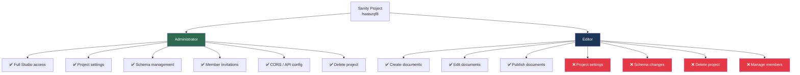
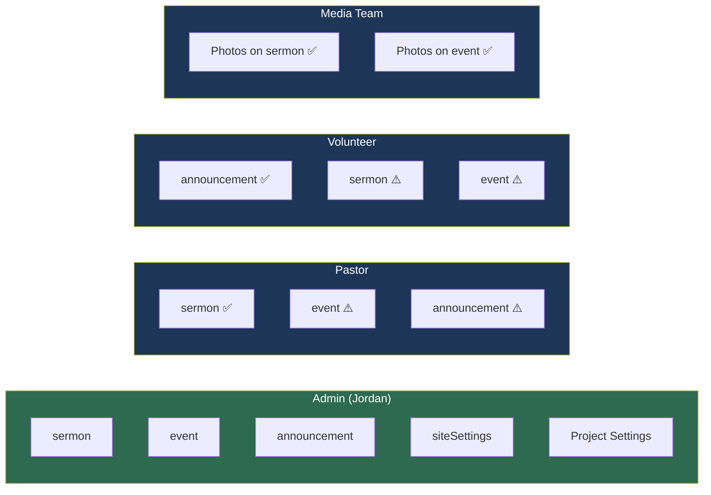

# Permissions Model — Unity Community Church CMS

> Convention-based role assignments for Sanity Studio.
> Sanity's free plan provides two built-in roles: **Administrator** and **Editor**. Granular per-schema permissions require a paid Team plan — this model uses **training and convention** to scope each Editor to their content area.

---

## Role Assignments

| Person             | Sanity Role   | Scope (convention)                                         | Content Types                   |
| ------------------ | ------------- | ---------------------------------------------------------- | ------------------------------- |
| **Admin (Jordan)** | Administrator | Full access — all schemas, Studio settings, project config | All                             |
| **Pastor**         | Editor        | Trained to edit sermons only                               | `sermon`                        |
| **Volunteer**      | Editor        | Trained to edit announcements only                         | `announcement`                  |
| **Media team**     | Editor        | Trained to edit photos (Phase 2)                           | `sermon` images, `event` images |

---

## How Sanity Roles Work

### Administrator (Admin only)

- Full read/write access to all content types
- Access to **project settings** (API keys, CORS, datasets, members)
- Can invite/remove team members and change roles
- Can deploy Studio and modify `sanity.config.ts`
- Can delete the project entirely

### Editor (Pastor, Volunteer, Media team)

- Can **create, edit, and publish** any document type visible in Studio
- **Cannot** access project settings, manage members, or delete the project
- **Cannot** modify schemas or deploy Studio
- Scope is enforced by **training**, not technical restriction — each Editor is instructed to only edit their assigned content area

> [!IMPORTANT]
> On the Sanity free plan, all Editors have the **same technical permissions**. A Pastor _could_ technically edit an announcement. The convention model relies on clear communication and training during onboarding.

---

## Convention Scope by Role

| Symbol | Meaning                                                        |
| ------ | -------------------------------------------------------------- |
| ✅     | Trained to edit — primary responsibility                       |
| ⚠️     | Technically accessible but **not their scope** — avoid editing |

---

## Security Boundaries

| Action                      | Administrator | Editor |
| --------------------------- | :-----------: | :----: |
| Create/edit/publish content |      ✅       |   ✅   |
| Upload images               |      ✅       |   ✅   |
| Access Studio UI            |      ✅       |   ✅   |
| View project settings       |      ✅       |   ❌   |
| Manage CORS origins         |      ✅       |   ❌   |
| Invite/remove members       |      ✅       |   ❌   |
| Deploy Studio               |      ✅       |   ❌   |
| Delete project              |      ✅       |   ❌   |
| Modify schemas (code)       |      ✅       |   ❌   |

---

## Onboarding a New Editor

### Step-by-step

1. Go to [sanity.io/manage](https://sanity.io/manage) → select project **hwaszqf8**
2. Navigate to **Members** → click **Invite member**
3. Enter the new member's email address
4. Select role: **Editor**
5. Click **Send invitation**
6. Share the Studio URL with them: `https://ucc-studio.sanity.studio`
7. Walk them through their **scope convention** — which content types they should edit

### Verification after invite

| Check                                  | Expected Result                                    |
| -------------------------------------- | -------------------------------------------------- |
| Editor can log in to Studio            | Studio loads, content sidebar visible              |
| Editor can create a sermon             | New sermon document saves and publishes            |
| Editor can create an announcement      | New announcement document saves and publishes      |
| Editor **cannot** see project settings | Settings page not visible or returns access denied |
| Editor **cannot** delete the project   | No delete option available                         |
| Editor **cannot** manage members       | Members page not accessible                        |

---

## Future: Custom Roles (Paid Plan)

When the team outgrows convention-based scoping, Sanity's **Team plan** ($99/month) enables custom roles with per-schema permissions:

| Custom Role         | Permissions                       |
| ------------------- | --------------------------------- |
| Sermon Editor       | Read/write on `sermon` only       |
| Event Editor        | Read/write on `event` only        |
| Announcement Editor | Read/write on `announcement` only |

This upgrade is tracked in the deferred items of [CMS_TASKS.md](file:///Users/admin/Desktop/Coding/ucc/ucc-app/docs/CMS_TASKS.md).
